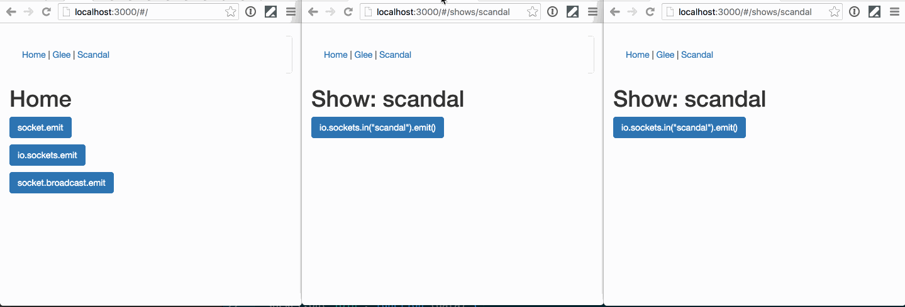

# Socket.io Sample Application




High points:

- Installing with a non-trivial express app
- Emitting events from a route
- Emitting events to
  - Just a current socket
  - Everyone
  - Everyone but the current socket
  - Everyone in a room
  - Everyone in a room but the current socket

Step 1:

```
npm install --save socket.io
```

Step 2:

Attach the socket in `bin/www`

```
var listener = server.listen(port);
var io = require('socket.io')(listener);

io.on('connection', function(socket){
  console.log('a user connected');
});
```

Step 3:

Make a connection

```
script(src="/socket.io/socket.io.js")
script.
  var socket = io();
```

Authentication:

https://auth0.com/blog/2014/01/15/auth-with-socket-io/ (old but good)
https://facundoolano.wordpress.com/2014/10/11/better-authentication-for-socket-io-no-query-strings/ - complex
https://developer.mozilla.org/en-US/docs/Web/API/WebSockets_API/Writing_WebSocket_client_applications - mdn


http://psitsmike.com/2011/10/node-js-and-socket-io-multiroom-chat-tutorial/

http://www.tamas.io/advanced-chat-using-node-js-and-socket-io-episode-1/

http://stackoverflow.com/questions/19156636/node-js-and-socket-io-creating-room
